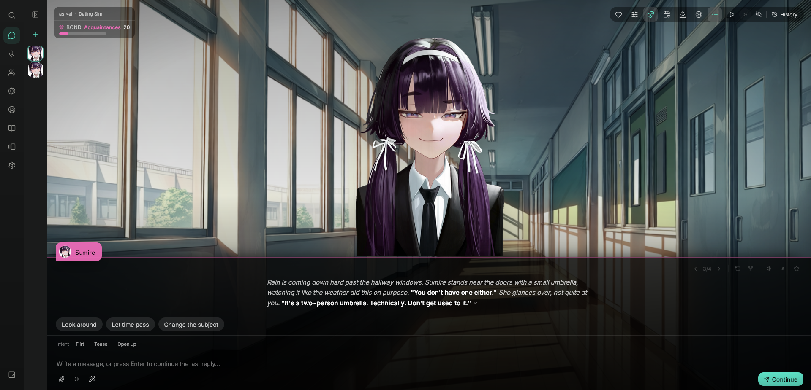
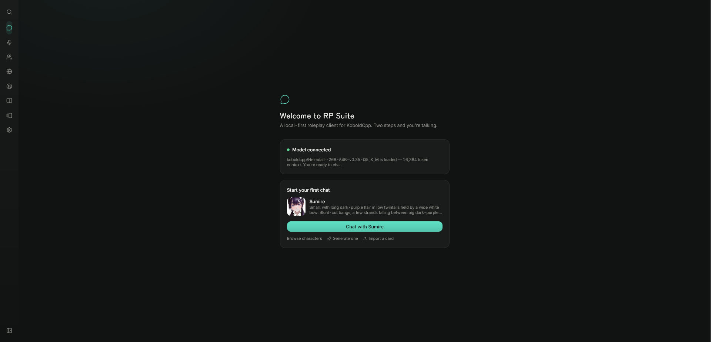
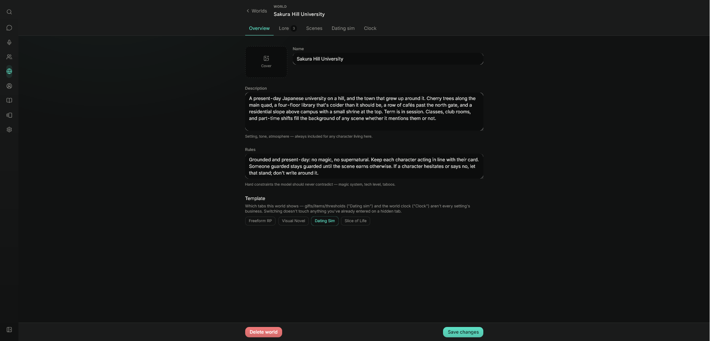

# RP Suite

A local-first roleplay client with a real dating-sim and visual-novel layer underneath, and a calm interface on top.

Import SillyTavern character cards and World Info lorebooks, keep the same low-level sampler control — then play a relationship that actually has continuity, stakes, and consequences instead of resetting every session.

<p align="center">
  
</p>

---

## Why

SillyTavern is powerful and looks like it. This keeps the parts worth keeping — card compatibility, lorebooks, full sampler access — and rebuilds the rest around two ideas:

- **The interface should get out of the way.** Large negative space, a single accent colour, no wall of buttons.
- **A roleplay should have stakes.** Relationship movement, scene outcomes and unlocks are decided by small validated model calls that the app then applies *deterministically* — never a number the model can simply declare.

Everything runs on your machine. Characters, chats, worlds and personas live in a SQLite file in `data/`. No accounts, no telemetry, no cloud sync.

---

## Getting started

**You'll need** [Node.js 22.5+](https://nodejs.org/) (developed on 24 — `node:sqlite` requires it) and a model backend, most commonly [KoboldCpp](https://github.com/LostRuins/koboldcpp) with a model loaded.

```bash
git clone https://github.com/pnotisdev/rp.git
cd rp
npm install
npm run dev
```

Opens on `http://localhost:5173`, with a local Express + SQLite API on port 3001. Go to Settings → Connection and point it at your backend. First run seeds one character and world so there's something to open immediately.

```bash
npm run build       # type-check and produce a production build
npm run typecheck   # type-check only
npm test            # run the suite once
npm run test:watch  # watch mode
```

---

## Features

### Model backends
- **KoboldCpp** — the primary target. Streaming, vision (with an mmproj), abort handling, token counting.
- **Any OpenAI-compatible endpoint** — OpenRouter, LM Studio, llama.cpp, TabbyAPI, oobabooga.
- **NovelAI** — chat and image generation, with its own tokenizer.
- Live connection status per backend, with an on-demand **Test connection** that uses a free metadata endpoint rather than spending a real generation.

### Characters
- Import/export **SillyTavern V2/V3 cards** (JSON or PNG), plus a `.rppack` bundle format carrying sprites, gallery, gift preferences and the bound world in one file.
- Full editor across seven tabbed sections, with **AI-assisted generation** for any individual field or a whole card from a one-line premise.
- Per-character **voice**, **reply length**, **instruct template**, sound-effect words, likes, goals, boundaries, occupation, home, and social connections.
- **Relationship starters** — authored "how you two already know each other" openings that seed long-term memory from message one.

### Visual novel presentation
- Full-bleed scene view: background, character sprite, dialogue box, backlog.
- **21 expression slots** per character, plus custom ones. The model tags each reply and the app resolves it — falling through same-family expressions before ever showing a blank avatar.
- **Outfits** — a second axis on the sprite grid, so wardrobe can change mid-scene. Per-outfit unlock gates, and resolution that degrades outfit art → base art → avatar so a half-drawn outfit still shows a real character.
- Scene backgrounds per world, unlockable by warmth; sprite crossfades; sakura petals; per-mood background music; manga-style SFX bursts.
- Optional **vision pass** that picks the expression by actually looking at your sprites.
- A **reactive portrait** in the ordinary chat layout during live scenes.

### Relationship simulation
- **Affection plus six dimensions** — trust, chemistry, comfort, respect, curiosity, tension — scored per turn by a validated model call and applied by the app.
- Derived **warmth** drives a six-stage ladder from near-strangers to sweethearts, with per-world thresholds.
- A separate **commitment ladder** — dating → exclusive → living together → married — that must be *asked for* and can be deflected or backfire. Warmth only gates when you may ask.
- **Breakups and reconciliation**: an explicit end, plus a slow-burn path where sustained tension raises a warning that becomes a real breakup after a grace period. Breakups leave lasting scars.
- **Character Mind** — a transient mood, a steadier unmet need, and a private intention, all tracked separately from the relationship itself. A character can love you and still be having a bad day.
- An append-only **event log**: every stat change with the one-line reason it happened.

### Dates, scenes and intimacy
- **Dates and hangouts** as live scored scenes. A date carries real stakes — including a hidden agenda the character never tells you, and the possibility they walk out. A hangout is the same with the stakes off.
- Per-turn scoring is suppressed during a scene in favour of a qualitative **live rapport** read, then settled in one end-of-scene judgement.
- **Intent chips** — tag a line as flirting, teasing, opening up, reassuring or apologising. It can land badly if misread.
- A warmth-gated **intimacy catalog** (~30 built-ins plus world-authored ones): kissing spots, positions, toys, activities — each a real clickable action, not just prompt flavour.
- **Aftercare**: an intimate scene opens a window of a few turns where the character is written as being in the aftermath. How you spend it is judged once at the end — tender, awkward or cold — and a cold aftermath leaves a lasting unmet need behind.
- A per-world **content rating** overriding the global one, so a wholesome world and an explicit one can sit side by side.

### Worlds
- A shared setting per group of characters: description, hard rules, its own lorebook and scene art.
- **World clock** with days, phases, seasons, weekday, seeded weather, and an energy/action economy.
- Authorable **relationship thresholds**, **gift catalog**, **item catalog**, **scene flags**, and **intimacy options**.
- **Rules** — an author-facing "when X, then Y" layer. Conditions over stats, scene flags, the commitment ladder or the clock; actions that write a durable memory, set a scene flag, or notify you. One-shot per chat by default. A closed set by design, not a scripting language.

### Economy, gifts and gallery
- Gift shop with per-character preferences, authored likes and dislikes, and a love language.
- Usable items with authored effects, and a bag.
- **CG gallery** unlocked by affection, story flags, or AI-detected story beats — plus dedicated **ending** entries that unlock at the top stage.

### World Info
- Full lorebook support: probability, inclusion groups with weighted selection, regex keys, recursive scanning, token budgets, and SillyTavern's complete activation set — **sticky, cooldown, delay**, and injection at a chat depth.
- A synthetic **Remembered facts** book: durable facts extracted from play, budget-capped and recency-prioritised.

### Chat
- Streaming with live tokens/sec and context usage, abort, auto-continue for truncated replies.
- **Swipes, forking, rewind, pinning, inline editing, search, trash and restore.**
- **AI-suggested choices**, impersonation, quick replies, author's note, objectives with AI-generated and AI-detected tasks.
- **Group chats** with per-character relationship tracking and four turn policies — manual, round-robin, mention-based, or an AI director.
- Long-term memory summarisation, and a **Prompt Inspector** showing exactly what was sent.
- Slop avoidance, verbatim-echo detection, RP markup normalisation, and user-defined regex scripts.

### Proactive characters
- Give a character a weekly schedule and let them **message you first** when they'd plausibly be free.
- **Companion mode** — hands-free voice: talk, it transcribes, the character replies, and it's read back aloud.
- Text-to-speech across KoboldCpp, OpenAI-compatible, ElevenLabs, Azure and Alibaba.

### Image generation
Optional, for sprites, backgrounds and CGs: **AUTOMATIC1111, ComfyUI, SwarmUI, or NovelAI**.

### Interface
- Command palette (`Ctrl`/`Cmd`-K), keyboard shortcuts sheet (`?`), themes with a full editor, responsive down to phone width, reduced-motion and reduced-audio options.
- One-file **backup and restore** of everything, including all media.

---

## Screenshots

<table>
<tr>
<td width="50%">

<p align="center"><em>First run: connected, one character ready.</em></p>
</td>
<td width="50%">

<p align="center"><em>Writing a character.</em></p>
</td>
</tr>
<tr>
<td width="50%">

<p align="center"><em>21 expression slots, per outfit.</em></p>
</td>
<td width="50%">

<p align="center"><em>A world: setting, rules, and which tabs it exposes.</em></p>
</td>
</tr>
</table>

<p align="center">
  
  <br>
  <em>Scene art per location, unlocked as a relationship warms.</em>
</p>

---

## Notes

**Local only.** The app talks to nothing except the backend you point it at. `data/` is a plain SQLite file plus real image and audio files — back it up, move it, or delete it to start fresh.

**Not a hosted product.** It assumes you can run a model, or bring an API key. There is no fallback if you can't.

**Stack.** React 18 + TypeScript + Vite + Tailwind + Zustand, Express + `node:sqlite` on the server. No ORM, no build-time codegen, 800+ tests.

## License

MIT. See [LICENSE](LICENSE).

## Credits

Built by [pnotisdev](https://github.com/pnotisdev). Inspired by [SillyTavern](https://github.com/SillyTavern/SillyTavern); built against [KoboldCpp](https://github.com/LostRuins/koboldcpp); indebted to the local-model and visual-novel communities whose card formats and conventions this tries to meet rather than reinvent.
